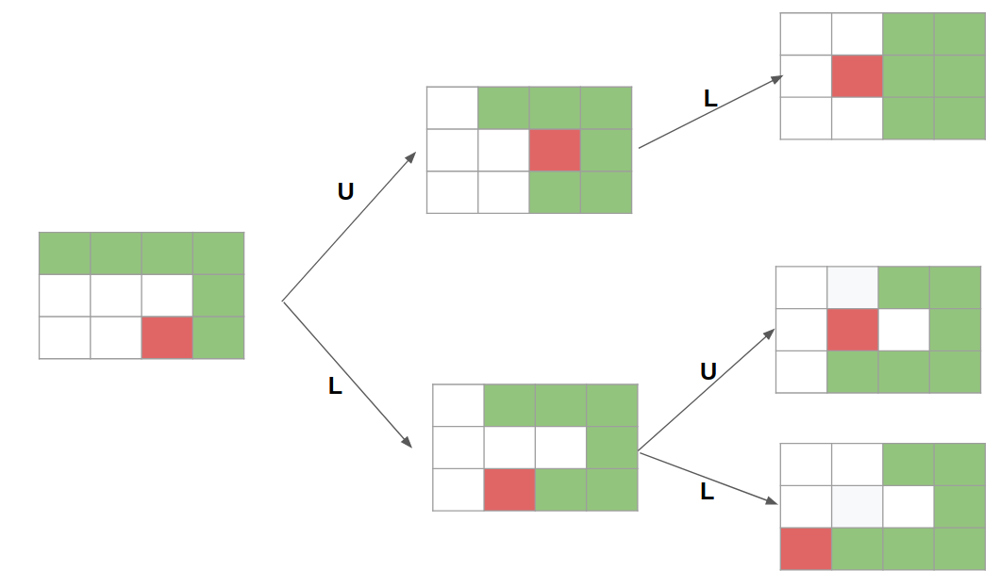

# Complexity Analysis of Path Finding Algorithm

Since the speed of the solution will be directly influenced by the complexity of the algorithm
used to find the paths, this document contains the complexity analysis of the method used.

The problem can be imagined as a tree graph where each node represents a board configuration, and the edges are valid moves:

  

Remark that we are interested on the number of nodes in the p-level of the tree.

[Breath-first search](https://en.wikipedia.org/wiki/Breadth-first_search) algorithm has been selected for searching the nodes that satisfy a given property. BFS has been chosen over DFS for various reasons including, 1. If you know a solution is not far from the root of the tree, a breadth first search (BFS) might be better 2. If the tree is very wide, a BFS might need too much memory, so it might be completely impractical. However, in our cases (only 4 moves) the tree won't be wide. Note: Take int account that BFS is a computationally expensive operation

The available path calculation is based on the BFS algorithm with early stopping in level p, implemented using a queue data structure. Remark that for a tree (our case), we don't need to keep track of visited nodes. Check the implementation in `src/path_calculator.py`.

## Time Complexity

In general, BFS time complexity is O(V) where V is the number of nodes (you need to traverse all nodes at worst). However, for our case, each node will have at worst 3 edges (3 possible moves), and we will early stop at depth p. Therefore,
at worst, we will traverse S(p) nodes, where

$$S(p) = 1 + 3 + 3^2 + 3^3 + ... + 3^p = \frac{3^{p+1} -1}{2}\text{  (sum of geometric series)}$$

On the one hand,

$$S(n) = \frac{3^{p+1} -1}{2} \geq  \frac{3^{p+1} -3^p}{2}=\frac{3^p(3 - 1)}{2} = 3^p \implies S(n)\geq 3^p$$

On the other hand, for 

$$S(n) = \frac{3^{p+1} -1}{2} \leq \frac{3^{p+1}}{2} =  \frac{3}{2}3^{p}$$

Thus,

$$3^{p}\leq S(p) \leq \frac{3}{2}3^{p}\implies S(n) = O(3^p)$$

In conclusion, **time complexity of finding available paths of depth p is O(3^p)**.

## Space Complexity

In general BFS space complexity is O(V) as well (since at worst case you need to hold all vertices of depth p in the queue). However, for our case, the maximum width of the tree will be at depth p, where we will hold all nodes of depth p (at most 3^p).

Therefore, **the space complexity of finding available paths of depth p is also O(3^p)**.

